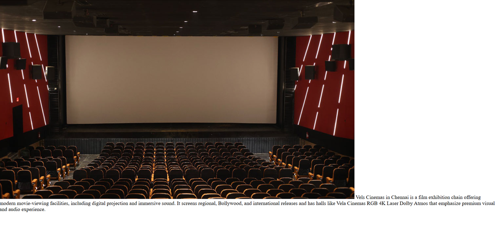
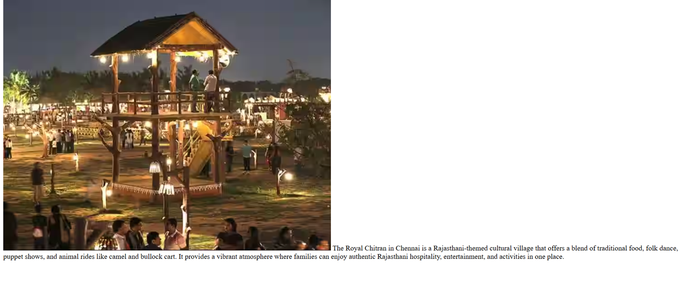

# Ex04 Places Around Me
## Date: 24/09/2025

## AIM
To develop a website to display details about the places around my house.

## DESIGN STEPS

### STEP 1
Create a Django admin interface.

### STEP 2
Download your city map from Google.

### STEP 3
Using ```<map>``` tag name the map.

### STEP 4
Create clickable regions in the image using ```<area>``` tag.

### STEP 5
Write HTML programs for all the regions identified.

### STEP 6
Execute the programs and publish them.

## CODE
```
<!DOCTYPE html>
<html lang="en">
<head>
    <meta charset="UTF-8">
    <meta name="viewport" content="width=device-width, initial-scale=1.0">
    <title>Document</title>
</head>
<body>
    !-- Image Map Generated by http://www.image-map.net/ -->


<map name="image-map">
    <area target="" alt="Queensland amusement park" title="Queensland amusement park" href="ql.html" coords="586,324,787,412" shape="rect">
    <area target="" alt="Vels cinemas" title="Vels cinemas" href="vels.html" coords="951,267,78" shape="circle">
    <area target="" alt="The royal chitran" title="The royal chitran" href="royal.html" coords="411,544,581,641,297,639" shape="poly">
</map>
</body>
</html>

<!DOCTYPE html>
<html lang="en">
<head>
    <meta charset="UTF-8">
    <meta name="viewport" content="width=device-width, initial-scale=1.0">
    <title>Document</title>
</head>
<body>
    
    Queensland Amusement Park in Chennai is a popular family destination offering thrilling rides, water attractions, and fun-filled entertainment. Spread over a vast area, it combines adventure and leisure with activities for all age groups.
</body>
</html>

<!DOCTYPE html>
<html lang="en">
<head>
    <meta charset="UTF-8">
    <meta name="viewport" content="width=device-width, initial-scale=1.0">
    <title>Document</title>
</head>
<body>
    
    The Royal Chitran in Chennai is a Rajasthani-themed cultural village that offers a blend of traditional food, folk dance, puppet shows, and animal rides like camel and bullock cart. It provides a vibrant atmosphere where families can enjoy authentic Rajasthani hospitality, entertainment, and activities in one place.
</body>
</html>

<!DOCTYPE html>
<html lang="en">
<head>
    <meta charset="UTF-8">
    <meta name="viewport" content="width=device-width, initial-scale=1.0">
    <title>Document</title>
</head>
<body>
    
    Vels Cinemas in Chennai is a film exhibition chain offering modern movie-viewing facilities, including digital projection and immersive sound. It screens regional, Bollywood, and international releases and has halls like Vela Cinemas RGB 4K Laser Dolby Atmos that emphasize premium visual and audio experience.
</body>
</html>
```


## OUTPUT





## RESULT
The program for implementing image maps using HTML is executed successfully.
